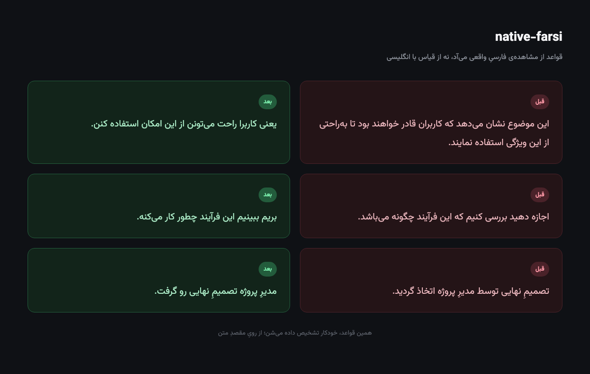

# native-farsi

A [Claude](https://claude.ai) skill for writing natural, authentic Persian (Farsi) — not text that sounds translated from English.

**[فارسی ⬇️](#فارسی)**



## The problem

Language models writing Persian usually carry over English syntax with Persian
words: noun-heavy sentences instead of verb-centered ones, overused passive
voice, translation-cliché phrases («این نشان می‌دهد که…» — "this shows that…"),
and mixed register (formal and colloquial forms in the same sentence).

This skill builds its rules from **observing real Persian**, not by analogy
with English.

## What's in it

- **Automatic register detection** from the text's destination (spoken, casual written, explanatory, formal)
- **Anti-calque rules**: words and structures that smell like translation
- **Register consistency**: a mechanical check against mixing literary and colloquial forms
- **Discourse layer**: issues above the sentence level (information order, pronoun reference)
- **Storytelling**: scene, character, suspense, throughline
- **Quantitative rhythm gauge**: measures sentence-length variance
- **Right-to-left documents**: Word, PowerPoint, PDF, HTML (with automated verify scripts)
- **Every rule is graded**: 🔴 absolute · 🟡 register-dependent · 🔵 diagnostic (a signal, not a verdict)

## Install

Two ways:

**1. As a Claude Skill** (recommended): zip this repo and upload it as a Skill
in Claude / Claude Code settings. Details: [Claude Skills docs](https://docs.claude.com/).

**2. Manual copy**: drop this repo's contents into `~/.claude/skills/native-farsi/`.

If you'll use the document-generation scripts:
```bash
pip install python-docx pypdf python-pptx pymupdf
bash scripts/install_fonts.sh
```

## Structure

```
SKILL.md                  entry point: detects mode and register, routes to reference files
references/
  core.md                  core: lexical calques, register consistency, orthography  [always]
  craft.md                 sentence construction, AI patterns, rhythm, discourse      [long text]
  spoken.md                 colloquial (شکسته) writing                                [spoken]
  voice-samples.md          guide to building your own corpus                         [spoken]
  storytelling.md           narrative: scene, character                               [narrative]
  documents.md               RTL docx/pptx/PDF/HTML                                    [file output]
scripts/
  rhythm_check.py            quantitative rhythm gauge
  verify_docx.py, verify_pdf.py, install_fonts.sh
assets/fonts/                Vazirmatn + Lalezar (SIL OFL)
```

## Why no bundled corpus?

Good spoken-Persian samples belong to a speaker. Instead of shipping someone
else's transcripts, `voice-samples.md` teaches you how to build a personal
corpus from your own sources.

## Governing principle

No rule is absolute. Every rule depends on register and audience. Before a
rule is codified, test it against real Persian; if a real Persian speaker
would break it, the rule is wrong.

## License

MIT. The document-generation portion (`references/documents.md`,
`scripts/verify_*.py`, `scripts/install_fonts.sh`) is adapted from
[persian-writing](https://github.com/ali2000hos/persian-writing), also MIT —
see [THIRD-PARTY-NOTICES.md](THIRD-PARTY-NOTICES.md). Fonts under SIL OFL 1.1.

---

## فارسی

یه اسکیلِ [Claude](https://claude.ai) برایِ نوشتنِ فارسیِ اصیل و طبیعی؛ نه فارسیِ
ترجمه‌شده از انگلیسی.

### مشکل چیه؟

مدل‌هایِ زبانی وقتی فارسی می‌نویسن، معمولاً نحوِ انگلیسی رو با واژه‌هایِ فارسی می‌چینن:
جمله‌هایِ اسم‌محور به‌جایِ فعل‌محور، مجهولِ زیادی، کلیشه‌هایِ ترجمه‌ای («این نشان می‌دهد
که…»)، و رجیسترِ قاطی (رسمی و محاوره تو یه جمله).

این اسکیل قاعده‌هاشو از **مشاهده‌ی فارسیِ واقعی** می‌سازه، نه از قیاس با انگلیسی.

### چی داره

- **تشخیصِ خودکارِ رجیستر** از رویِ مقصدِ متن (گفتاری، صمیمیِ نوشتاری، توضیحی، رسمی)
- **ضدِ کالک**: واژه‌ها و ساختارهایی که بویِ ترجمه می‌دن
- **یکدستیِ رجیستر**: چکِ مکانیکی برایِ قاطی‌نشدنِ کتابی و محاوره
- **لایه‌ی گفتمان**: مشکلاتی که بالاترِ سطحِ جمله‌ن (ترتیبِ اطلاعات، ارجاعِ ضمیر)
- **قصه‌گویی**: صحنه، شخصیت، تعلیق، پی‌رنگ
- **سنجه‌ی کمّیِ ریتم**: واریانسِ طولِ جمله رو اندازه می‌گیره
- **اسنادِ راست‌چین**: Word، PowerPoint، PDF، HTML (با اسکریپتِ وریفایِ خودکار)
- **هر قاعده درجه‌بندی شده**: 🔴 مطلق · 🟡 وابسته‌به‌رجیستر · 🔵 تشخیصی (نه حکم)

### نصب

دو راه:

**۱. به‌عنوانِ Claude Skill** (توصیه‌شده): این ریپو رو زیپ کن و تو تنظیماتِ
Claude/Claude Code به‌عنوانِ Skill آپلود کن. جزئیات: [مستنداتِ Claude Skills](https://docs.claude.com/).

**۲. کپیِ دستی**: محتوایِ این ریپو رو بریز تو `~/.claude/skills/native-farsi/`.

اگه قراره از اسکریپت‌هایِ تولیدِ سند استفاده کنی:
```bash
pip install python-docx pypdf python-pptx pymupdf
bash scripts/install_fonts.sh
```

### چرا کورپوس نداره؟

نمونه‌هایِ گفتاریِ خوب متعلق به یه گوینده‌ن. به‌جایِ کپی‌کردنِ متنِ کسِ دیگه،
`voice-samples.md` بهت یاد می‌ده چطور از منابعِ **خودت** یه کورپوسِ شخصی بسازی.

### اصلِ حاکم

هیچ قانونی مطلق نیست. هر قاعده به رجیستر و مخاطب وابسته‌ست. قبلِ ثبتِ هر قاعده،
با فارسیِ واقعی تستش کن؛ اگه یه فارسی‌زبانِ واقعی نقضش می‌کنه، قاعده غلطه.

### مجوز

MIT. بخشِ تولیدِ سند (`references/documents.md`، `scripts/verify_*.py`،
`scripts/install_fonts.sh`) از [persian-writing](https://github.com/ali2000hos/persian-writing)
قرض گرفته شده، جزئیات در [THIRD-PARTY-NOTICES.md](THIRD-PARTY-NOTICES.md).
فونت‌ها تحتِ SIL OFL 1.1.
